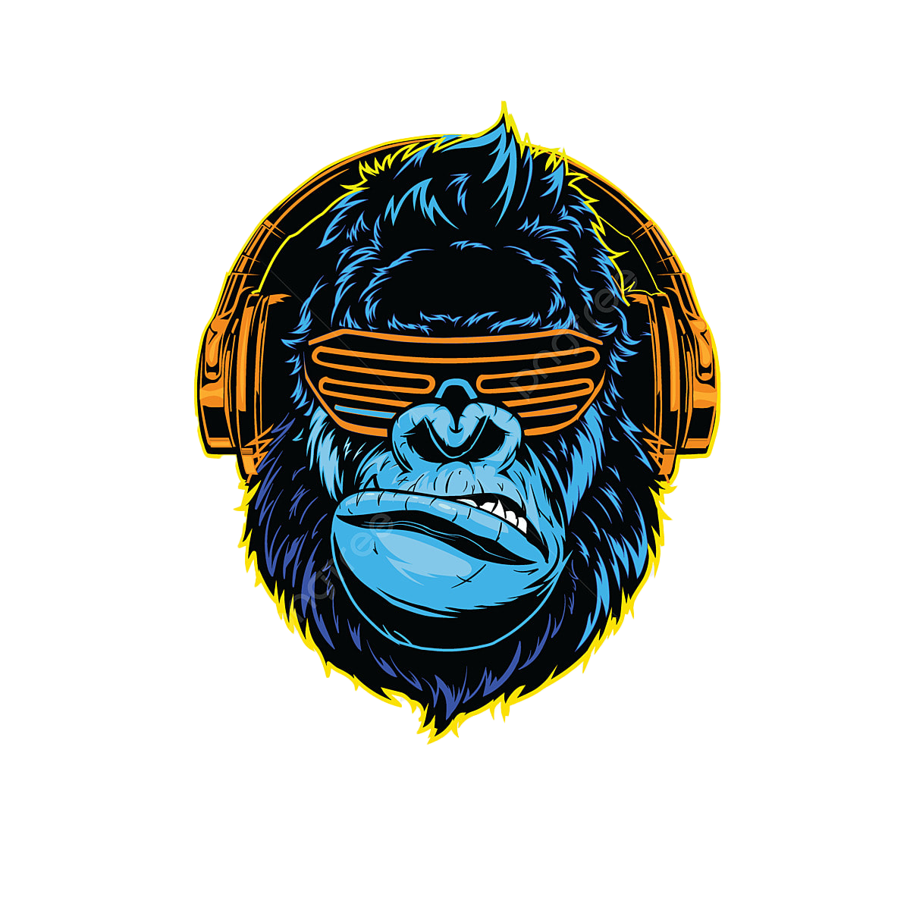

# Music Mixer Assignment

##### Sheldon Gohetia & Henrique Gamborgi Menezes

## Introduction

This repository is dedicated for the Music Mixer Project, an assignment of the course Multimedia Authoring 2, of the Interactive Media Design (IDP3) graduation program on Fanshawe College, Summer semester, 2024.

The focus of this project is to collaboratively research, experiment with and ultimately design and build a multimedia application using
design and motion tools as well as HTML, CSS and JavaScript. The team will implement drag and drop functionality to load audio clips
and create a dynamic audio experience, trigger animation, and play a compiled audio track.

## Installation

1. Click on the link to the sample repository provided;
2. On the repo, click on the green button "< > Code";
3. On the last option, click on "Download zip";
4. Unzip the folder.

## Usage

1. Download the folder on your device;
2. Open the index.html file on the browser of your choice;
3. Drag and drop the instrument icons to create your own music;
4. Switch to "Mini Player" to play our pre-made music selection.

## Project

### Overview

For this project, we will be building a drag and drop music mixer, using the chorus of a royalty-free music called "Half a Heart", by Little Empire, in which the author made available for free the multitracks of each instrument used on their song. Our job here is to isolate the audios and pick a loop for the 6 instruments we are going to use, design their icons and finally code the drag and drop interaction in our website.

The main idea is that the user can "build" the song with different instruments, choosing if he wants to hear only the drums, only the vocals or only the bass for that track. We will be using HTML, CSS and JavaScript to develop a virtual experience, where the user can drag and drop each instrument to recreate the song as he wants to, restart it or control the volume.

### Requirements

ONLY THE MAIN BRANCH WILL BE GRADED.NOT ZIPPED FILES!
- Github repo: readme.md file, master branch, design branch and development branch
- correct structure for a web project (css, js, images, audio etc and index.html)
- DO NOT INCLUDE AI OR PSD FILES - just the SVGs / .png / .jpg in the image folder will do.
- Name the dev branches appropriately per feature IE des.tvr.artwork, dev.tvr.script

### Due Date

Project must be submitted within Week 12 class time: 

### Grading Rubric
- Folder Setup & Naming /1
- GitHub Best Practices /3
- Valid HTML and CSS /2
- Design and Layout /4
- Functionality and Interactivity /10
- Total = 20

## Credits

The credits are due to Sheldon Gohetia and Henrique Gamborgi Menezes, students of the Interactive Media Design program at Fanshawe College.

## License

MIT License

Copyright (c) 2024 Sheldon Gohetia & Henrique Gamborgi

Permission is hereby granted, free of charge, to any person obtaining a copy of this software and associated documentation files (the "Software"), to deal in the Software without restriction, including without limitation the rights to use, copy, modify, merge, publish, distribute, sublicense, and/or sell copies of the Software, and to permit persons to whom the Software is furnished to do so, subject to the following conditions:

The above copyright notice and this permission notice shall be included in all copies or substantial portions of the Software.

THE SOFTWARE IS PROVIDED "AS IS", WITHOUT WARRANTY OF ANY KIND, EXPRESS OR IMPLIED, INCLUDING BUT NOT LIMITED TO THE WARRANTIES OF MERCHANTABILITY, FITNESS FOR A PARTICULAR PURPOSE AND NONINFRINGEMENT. IN NO EVENT SHALL THE AUTHORS OR COPYRIGHT HOLDERS BE LIABLE FOR ANY CLAIM, DAMAGES OR OTHER LIABILITY, WHETHER IN AN ACTION OF CONTRACT, TORT OR OTHERWISE, ARISING FROM, OUT OF OR IN CONNECTION WITH THE SOFTWARE OR THE USE OR OTHER DEALINGS IN THE SOFTWARE.
